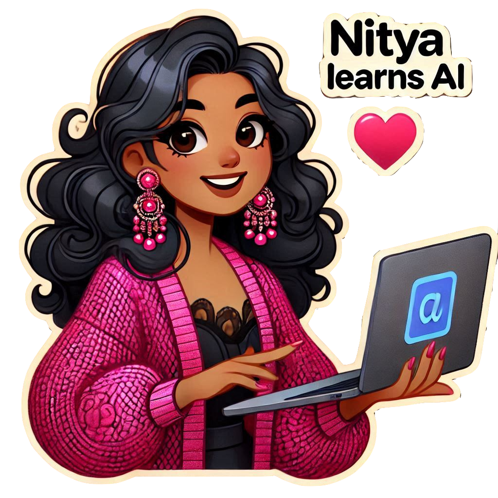

# About Me

Welcome to my world! **My name is Nitya Narasimhan and I am a PhD, a Polyglot, and a Parent.** I've worked in tech for nearly three decades in roles spanning research, engineering, and advocacy. I've also been a community leader in the Greater New York region for over a decade, organizing meetups and conferences that have skilled thousands of developers. Most importantly, as a parent and educator, I am increasingly invested in **helping people learn AI** in a way that makes these complex topics feel more relatable with ready-to-use resources that help translate awareness into action.

My day job as an AI advocate at Microsoft is focused on the Azure AI platform. But my personal interests span a variety of topics from open-source tooling to visual storytelling and creative content projects that put the _fun_ in fundamentals. And I wanted to do something that helped me bridge these personas. **Nitya Learns AI** is the result! I decided to revisit the success of my [#30DaysOf](https://github.com/30DaysOf) learning projects - but focus it on my personal learning journey instead. 

Look for my [LinkedIn](https://www.linkedin.com/in/nityan) newsletter with this title, to get the latest news and updates on this journey. And look for this sticker in project repos (on "About Me" pages like this one) and in my illustrated guides (in new "Sketch The Docs" projects) to explore actionable outcomes. **Learn with me and commit to adding one AI-related skill to your toolkit in 2025**

---

